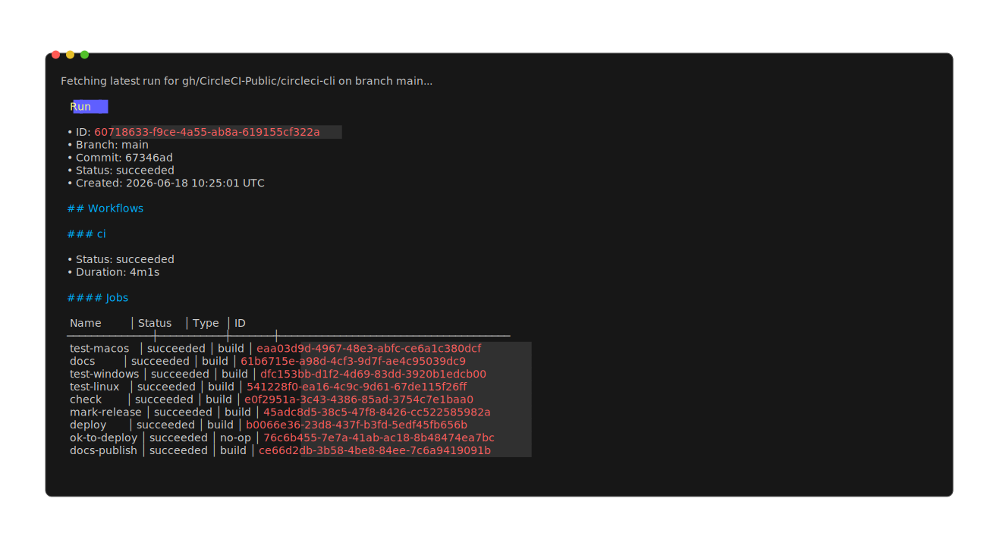

# circleci-cli

> **Preview release** — this branch (`main`) tracks the new CLI rewrite. It is under
> active development and not yet stable. For the current stable CLI, see
> [stable installation](#stable-installation).

This is CircleCI's command-line application.

[Documentation](https://cli.circleci.com/reference/) |
[Code of Conduct](./CODE_OF_CONDUCT.md) |
[Contribution Guidelines](./CONTRIBUTING.md) |

[](https://circleci.com/gh/CircleCI-Public/circleci-cli)
[](https://github.com/CircleCI-Public/circleci-cli/releases)
[](https://godoc.org/github.com/CircleCI-Public/circleci-cli)
[](./LICENSE)

`circleci` is CircleCI's official command line tool. It is an agent-friendly CLI that brings CI runs, jobs,
configuration, and other CircleCI features to the terminal right where you're already working.

<p align="center">
  <a href="./docs/demos/run-get.svg">
    
  </a>
</p>

The CLI is supported for users on [circleci.com](https://circleci.com) and CircleCI server; with support for macOS,
Windows, and Linux.

---

## Preview: CLI v1.x now available

A ground-up rewrite of the agent-friendly CircleCI CLI is available for preview.

### What's new

- **`circleci run`** — Full pipeline run management: list, get, trigger, cancel, and watch runs from the terminal. `run watch` blocks until a run completes and exits with a status code that reflects the result, making it easy to script CI gating.
- **`circleci deploy`** — View deployed components and versions across environments, and initialize CircleCI Deploys for a project.
- **`circleci dlc purge`** — Invalidate Docker layer caching for a project to force a fresh image build on the next run.
- **`circleci workflow`** — List, inspect, cancel, and rerun individual workflows.
- **`circleci pipeline`** — List and inspect pipelines.
- **`circleci envvar`** — Manage project environment variables.
- **`--json` on every command** — Every data-returning command supports `--json` for machine-readable, scriptable output.
- **MCP server** — First-class [Model Context Protocol](https://modelcontextprotocol.io) support: register the CLI as an MCP server in Claude, Cursor, or VS Code with a single command.
- **Shell completions** — Bash and Zsh completions via `circleci completion`.

> **Note:** This is a preview release. Commands and flags may change before stable. Please [open an issue](https://github.com/CircleCI-Public/circleci-cli/issues) with any feedback.

---

## Installation

### Preview installation

Install the preview (v1.x) CLI via one of the following package managers:

Homebrew:

*If you have the stable CLI installed:*
```shell
brew uninstall circleci
```
Then:
```shell
brew install circleci-public/circleci/circleci@next
```

Snap (edge channel):
```shell
sudo snap install circleci --channel=edge
sudo snap connect circleci:password-manager-service
```

WinGet:
```shell
winget install --id CircleCI.CLI.Preview
```

### Previous stable version

If you need the previous stable version, install via HomeBrew, Snap, WinGet, or Chocolatey:

Homebrew:
```shell
brew install circleci
```

Snap:
```shell
sudo snap install circleci
```

WinGet:
```shell
winget install --id CircleCI.CLI
```

Chocolatey:
```shell
choco install circleci-cli -y
```

## Setup

### Login
Run the following command to login to the CircleCI CLI:
```shell
circleci auth login
```

### Model Context Protocol (MCP)
The CLI supports the MCP protocol. To enable it, run:

Claude:
```shell
circleci mcp claude enable # Enable in Claude desktop
claude mcp add-from-claude-desktop -s user # Add with current user scope
```

Cursor:
```shell
circleci mcp cursor enable
```

VS Code:
```shell
circleci mcp vscode enable
```

## Development

### Local

This repository makes use [Task](https://taskfile.dev/#/) which can be installed (on MacOS) with:

```
$ brew install go-task/tap/go-task
```

Most other tools referenced in the `Taskfile.yml` are managed by the go.mod tool section.

See the full list of available tasks by running `task -l`, or, see the [Taskfile.yml](./Taskfile.yml) script.

```sh
# Run all static checks
task check
# Auto-fix static checks
task fix
# Run all the tests
task test

# Run the quick tests
task test -- -short ./...
# Run the quick tests for one package
task test -- -short ./internal/...

# Format all the code
task fmt
# Apply license headers
task license
# Tidy go.mod
task mod-tidy
```
