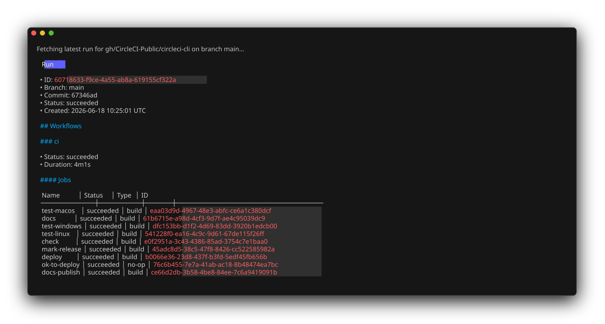

# circleci-cli

This is CircleCI's command-line application.

[Documentation](https://cli.circleci.com/reference/) |
[Code of Conduct](./CODE_OF_CONDUCT.md) |
[Contribution Guidelines](./CONTRIBUTING.md) |

[](https://circleci.com/gh/CircleCI-Public/circleci-cli)
[](https://github.com/CircleCI-Public/circleci-cli/releases)
[](https://godoc.org/github.com/CircleCI-Public/circleci-cli)
[](./LICENSE)

`circleci` is CircleCI's official command line tool. It is an agent-friendly CLI that brings CI runs, jobs,
configuration, and other CircleCI features to the terminal right where you're already working.

<p align="center">
  <a href="./docs/demos/run-get.svg">
    
  </a>
</p>

The CLI is supported for users on [circleci.com](https://circleci.com) and CircleCI server; with support for macOS,
Windows, and Linux.

## Installation

Install the CLI via one of the following package managers:

#### Homebrew

```shell
brew install circleci
```

#### WinGet
```shell
winget install --id CircleCI.CLI
```

#### Snap

```shell
sudo snap install circleci
sudo snap connect circleci:password-manager-service
```

#### Debian

Debian packages are hosted at `packages.circleci.com` for various operating systems including:

- [Debian](https://www.debian.org/)
- [Raspberry Pi](https://www.raspberrypi.com/)
- [Ubuntu Linux](https://ubuntu.com/)

To install packages, you can quickly setup the repository automatically:

```shell
curl -1sLf 'https://packages.circleci.com/public/setup.deb.sh' | sudo -E bash
```

**or** you can manually configure it yourself before installing packages:
```shell
apt-get install -y debian-keyring  # debian only
apt-get install -y debian-archive-keyring  # debian only
apt-get install -y apt-transport-https
# For Debian Stretch, Ubuntu 16.04 and later
keyring_location=/usr/share/keyrings/circleci-deps-public-archive-keyring.gpg
# For Debian Jessie, Ubuntu 15.10 and earlier
keyring_location=/etc/apt/trusted.gpg.d/circleci-deps-public.gpg
curl -1sLf 'https://packages.circleci.com/public/gpg.B3F71F41836351D6.key' |  gpg --dearmor >> ${keyring_location}
curl -1sLf 'https://packages.circleci.com/public/config.deb.txt?distro=ubuntu&codename=xenial&component=main' > /etc/apt/sources.list.d/circleci-deps-public.list
sudo chmod 644 ${keyring_location}
sudo chmod 644 /etc/apt/sources.list.d/circleci-deps-public.list
apt-get update
```
*Note: Please replace ubuntu, xenial and main above with your actual operating system (distribution and distribution release/version) and components (based on what's in this repository).*

Then install:
```shell
sudo apt install circleci
```

#### RedHat

RPM packages are hosted at `packages.circleci.com` for various operating systems including:

- [Amazon Linux 2](https://aws.amazon.com/amazon-linux-2/)
- [CentOS](https://www.centos.org/)
- [Fedora](https://fedoraproject.org/)
- [Red Hat Enterprise Linux](https://www.redhat.com/en/technologies/linux-platforms/enterprise-linux)
- [openSUSE](https://www.opensuse.org/)
- [SUSE](https://www.suse.com/)


For most RPM based distributions (RHEL, CentOS, Fedora, SUSE), you can quickly setup the repository automatically:

```shell
curl -1sLf 'https://packages.circleci.com/public/setup.rpm.sh' | sudo -E bash
```

**or** manual Yum setup (RHEL, CentOS, Amazon Linux):
```shell
yum install yum-utils pygpgme

rpm --import 'https://packages.circleci.com/public/gpg.B3F71F41836351D6.key'
curl -1sLf 'https://packages.circleci.com/public/config.rpm.txt?distro=el&codename=7' > /tmp/circleci-deps-public.repo
yum-config-manager --add-repo '/tmp/circleci-deps-public.repo'
yum -q makecache -y --disablerepo='*' --enablerepo='circleci-deps-public'
```
*Note: Please replace el and 7 above with your actual distribution/version and use Wildcards when enabling multiple repos.*

**or** manual DNF setup (Fedora):
```shell
dnf install yum-utils pygpgme

rpm --import 'https://packages.circleci.com/public/gpg.B3F71F41836351D6.key'
curl -1sLf 'https://packages.circleci.com/public/config.rpm.txt?distro=fedora&codename=29&dnf_version=5' > /tmp/circleci-deps-public.repo
dnf config-manager addrepo --from-repofile='/tmp/circleci-deps-public.repo'
dnf -q makecache -y --disablerepo='*' --enablerepo='circleci-deps-public' --enablerepo='circleci-deps-public-source'
```

*Note: Please replace fedora and 29 above with your actual distribution/version.*

Then install:
```shell
dnf install circleci
```

or:
```shell
yum install circleci
```

## Setup

### Login
Run the following command to login to the CircleCI CLI:
```shell
circleci auth login
```

### Model Context Protocol (MCP)
The CLI supports the MCP protocol. To enable it, run:

Claude:
```shell
circleci mcp claude enable # Enable in Claude desktop
claude mcp add-from-claude-desktop -s user # Add with current user scope
```

Cursor:
```shell
circleci mcp cursor enable
```

VS Code:
```shell
circleci mcp vscode enable
```

## Development

### Local

This repository makes use [Task](https://taskfile.dev/#/) which can be installed (on MacOS) with:

```
$ brew install go-task/tap/go-task
```

Most other tools referenced in the `Taskfile.yml` are managed by the go.mod tool section.

See the full list of available tasks by running `task -l`, or, see the [Taskfile.yml](./Taskfile.yml) script.

```sh
# Run all static checks
task check
# Auto-fix static checks
task fix
# Run all the tests
task test

# Run the quick tests
task test -- -short ./...
# Run the quick tests for one package
task test -- -short ./internal/...

# Format all the code
task fmt
# Apply license headers
task license
# Tidy go.mod
task mod-tidy
```
